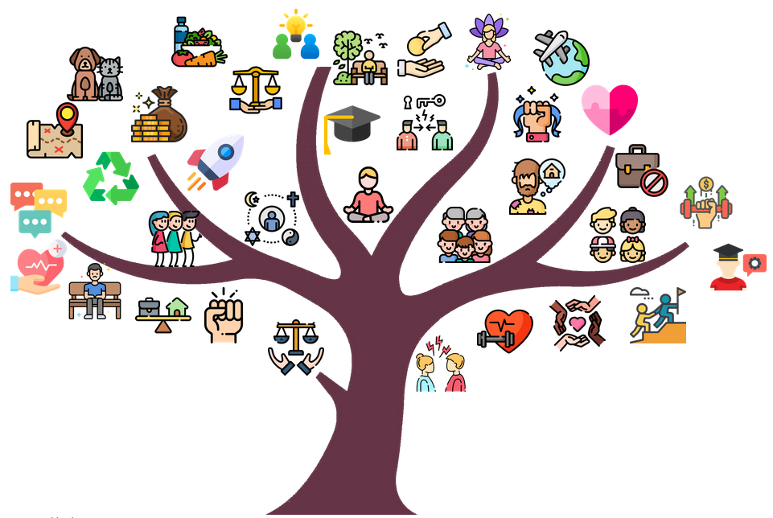

# Tree Yourself
Why do you do what you do? What is the engine that keeps you up late at night or gets you going in the morning?

The TreeYourself website allows you to affirm the values and goals you hold dear and visualize them in a beautiful tree.

A 2019 National Bureau of Economic Research [study](https://www.nber.org/digest/dec19/women-persistently-sell-themselves-short-same-skill-men) showed after writing about their own accomplishments and goals woman performed 30 % better in contests. For the challenges in Avanade International Women's Day Hackathon 'Reducing Bias' and Women in Cloud 'Allyship' we can come up with a tree filled by icons that relate to  the answers you gave.



## installation guide
navigate to the folder you want to install the folder and open a shell

```shell
git clone https://github.com/HoergerL/TreeYourself
cd TreeYourself
python -m venv venv
.\venv\scripts\activate
python -r install requirements.txt
flask run
```

# Hackathon Pitch

Why do you do what you do? What is the engine that keeps you up late at night or gets you going in the morning? Where is your happy place? What stands between you and your ultimate dream?

TreeYourself allows you to affirm the values and goals you hold dear and visualize them in a beautiful tree.

It's been demonstrated that a short writing exercise in setting goals has a startling effect: nearly erasing the gender and ethnic minority achievement gap over just two years. TreeYourself wants to facilitate this process.

## What it does
- Answer a range of question by writing freely about them. 
- Helps you develop a vision for the future and representing it in a beautiful tree.  
- The goal is to alleviate anxiety about the future through a feeling of clarity of purpose and direction, thus bolstering confidence and helping you succeed in job interviews, finding fitting mentors and many other positive life long effects!

## How we built it
The website is written in Python using the Flask webframework. The answers are analyzed by Natural language processing (NLP) algorithm with the help of the "facebook/bart-large-mnli" (BART) model from https://huggingface.co/. The "facebook/bart-large-mnli" model is a zero-shot-classifier, which means that the user can define tags and the algorithms maps one or multiple of the defined tags to every text input.
Based on the tags a beautiful tree, including all your dreams and wishes is rendered. The "fruits" of the tree represent them and can be interacted with by linking back to the text passage that the user has written about them!

## Challenges we ran into
The first challenge was to implement the NLP integration of the BART model and balance the right amount of tags and their values. There is a huge variety of different answers when it comes to dreams and wishes and we didn't want to worsen the user experience by not covering all of them. But we had to limit the number of tags, especially because the runtime of the NLP significantly increased when adding new tags. So we decided to use around 30 tags, to have a good balance between diversity of tags and runtime of the NLP algorithm.
The next challenge was finding free icons, without a limiting license, for all the tags. As some of the tags are quite abstract (e.g. leadership career) it's difficult to cover them in an icon. Additionally the icons need to be created in a similar drawing style to have a consistent tree. We found the website https://icons8.com/, where you can use all the icons but you have to link to their website, to give them credit. 
The last challenge was to automatically generate a tree for every conceivable combination of tags and making the tree interactive by making its "fruits" clickable, linking back to the written passage they represent. We solved this by giving each icon a fixed place on the tree and making it appear when the written texts got mapped to the tag by the BART model.

## Accomplishments that we're proud of
- working website
- reasonable and crucial use of an NLP algorithm
- beautiful and inspiring design despite not having a designer on our team
- an idea we all believe in!

## What we learned
Working as a project-team, formulating an idea collaboratively, anticipating challenges, splitting into modules and communicating interface inputs and outputs, time-management tools like kanban. Technologies: Flask, CSS, Bootstrap, NLP/BART resources like huggingfaces.co, using git in a team!

## What's next for TreeYourself
- Host on a public website, 
- integrate more tags,
- better mapping between mentor and mentee
- more efficient AI integration

## Inspiration
https://www.selfauthoring.com/
